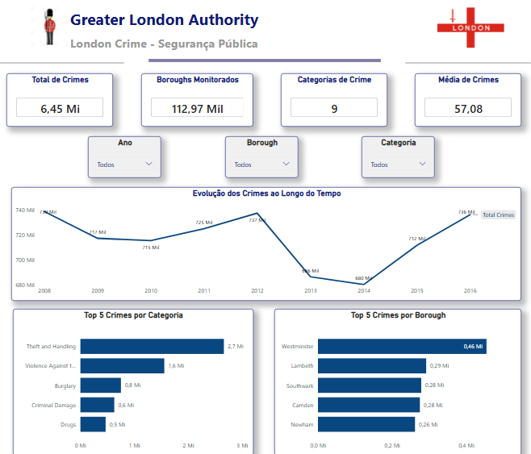
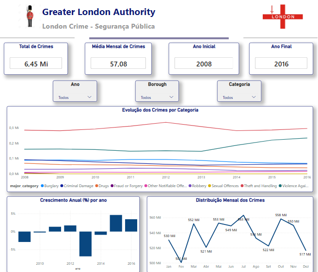
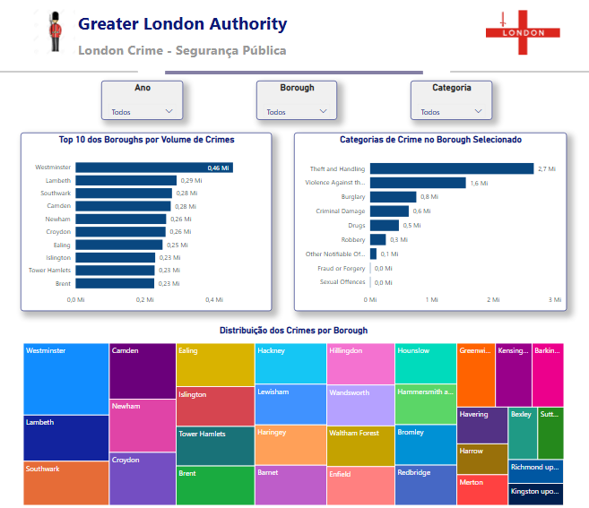
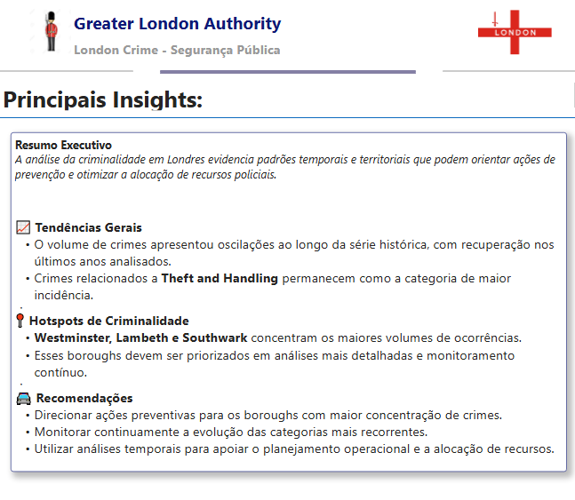

# 🚔 London Crime Analysis

### Dashboard de análise da criminalidade em Londres desenvolvido com Google Cloud Platform, BigQuery, Python e Power BI.

---

<p align="center">
  
</p>

---

## 📈 Os indicadores

- Total de crimes registrados
- Evolução anual dos crimes
- Crimes por Borough
- Crimes por categoria
- Comparação entre regiões
- Tendência temporal

---

## 📌 Sobre o projeto

Este projeto apresenta uma análise exploratória dos dados de criminalidade em Londres por meio de um dashboard desenvolvido no **Power BI**.

O objetivo foi transformar dados públicos em informações estratégicas, utilizando técnicas de ETL, análise exploratória e Business Intelligence.

O dashboard foi construído com foco em clareza, usabilidade e storytelling com dados, reunindo métricas e visualizações que facilitam a compreensão do cenário da criminalidade na cidade.

---

## 🎯 Objetivos

* Analisar a evolução da criminalidade em Londres.
* Identificar os tipos de crimes com maior ocorrência.
* Comparar a distribuição dos crimes entre os bairros (boroughs).
* Explorar tendências ao longo do tempo.
* Desenvolver um dashboard interativo para análise dos dados.

---

## 🛠️ Ferramentas utilizadas

- Google Cloud Platform (GCP)
- Google BigQuery
- SQL
- Python
- Pandas
- Visual Studio Code
- Microsoft Power BI
- Git
- GitHub

---

## 🔄 Metodologia

O desenvolvimento do projeto foi realizado seguindo um fluxo completo de análise de dados:

1. Extração dos dados no Google BigQuery.
2. Consultas SQL para exploração e seleção das informações.
3. Tratamento, limpeza e padronização dos dados utilizando Python no Visual Studio Code.
4. Construção da base analítica e validação dos dados antes da etapa de visualização.
5. Desenvolvimento do dashboard com indicadores, filtros e visualizações interativas.
6. Documentação e versionamento do projeto utilizando Git e GitHub.

---

## 📊 Dashboard

### Página 1 — Visão Geral


---

### Página 2 — Evolução Temporal



---

### Página 3 — Análise Territorial



---

### Página 4 — Insights




O dashboard foi estruturado em páginas para facilitar a análise dos indicadores.

Entre as principais visualizações estão:

* KPIs gerais;
* Evolução temporal dos crimes;
* Distribuição por tipo de crime;
* Comparação entre bairros;
* Gráficos de barras, linhas e pizza;
* Filtros interativos para exploração dos dados.

---

## 📁 Estrutura do projeto

```text
dashboard/
dados/
imagens/
README.md
```

---

## 💡 Principais insights

* Identificação dos tipos de crimes com maior incidência.
* Comparação entre regiões com maiores índices de criminalidade.
* Visualização da evolução dos registros ao longo do tempo.
* Dashboard desenvolvido para facilitar análises rápidas e apoiar decisões baseadas em dados.

---

## 💼 Competências demonstradas

- Extração de dados em ambiente Cloud (Google Cloud Platform)
- Consultas SQL no BigQuery
- Limpeza e transformação de dados com Python
- Construção de base analítica
- Modelagem para Business Intelligence
- Desenvolvimento de dashboards no Microsoft Power BI
- Storytelling com dados
- Versionamento de projetos com Git e GitHub

---

## 🚀 Aprendizados

Durante este projeto foi possível aprofundar conhecimentos em:

- Coleta de banco de dados no Google Cloud;
- Limpeza e organização de dados no VS Code com Python e SQL;
- Construção de indicadores (KPIs);
- Storytelling com dados;
- Desenvolvimento de dashboards no Power BI;
- Boas práticas de visualização;
- Análise exploratória para suporte à tomada de decisão.

---

## 👩‍💻 Sobre mim

Sou Stéphanie Rosa, profissional em transição de carreira para a área de Dados, formada em Jornalismo e atualmente em formação em Análise de Dados.

Tenho desenvolvido projetos voltados para análise de dados, Business Intelligence e visualização de informações utilizando Python, SQL, Power BI, Google Looker Studio e Excel.

Este projeto faz parte do meu portfólio de Análise de Dados, desenvolvido para demonstrar competências em extração, tratamento, análise e visualização de dados utilizando tecnologias amplamente empregadas no mercado.

---

## 📫 Contato

**LinkedIn:** https://www.linkedin.com/in/stephanie-rosa/

**GitHub:** https://github.com/stedemoraes-source
